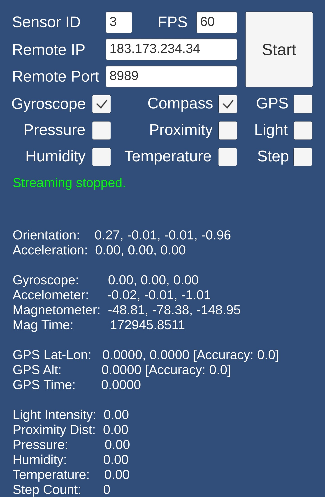
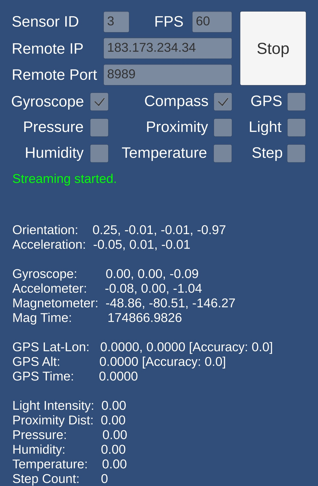
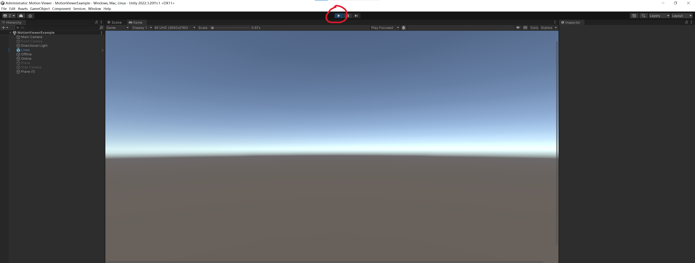

# Wearable Device IMU Data Collection

## Introduction
这个仓库提供了从日常可穿戴设备（如智能手机、智能手表和耳机）收集IMU等传感器数据并进行动作捕捉Livedemo演示的工具和示例代码。支持的平台包括Android、华为和苹果设备

## System Overview
支持安卓系统的手机+手表，华为系统的手机+手表+耳机，苹果系统的手机+手表+耳机的传感器数据传输及Livedemo可视化演示

## Installation
### Android
1. **手机**: 从[链接](https://cloud.tsinghua.edu.cn/f/6133d04747394d298bb5/?dl=1)下载**PhoneIMU.apk**并安装

2. **手表** (若有): 从[链接](https://cloud.tsinghua.edu.cn/f/69fd969c4ab24b5da0dd/?dl=1)下载**WatchIMU.apk**并安装
### Huawei
### Apple
### Livedemo
我们使用Unity来可视化实时演示。要开始：
1. 从[这个链接](https://cloud.tsinghua.edu.cn/f/c1fded497d7f441793e0/?dl=1)下载**Mocap Live Demo Unity package**
2. 从[Unity Hub](https://unity.com/download)下载并安装**Unity Editor version 2022.3.20f1c1**
3. 在Unity Editor中打开下载的项目
4. 在Unity Editor中，转到**Scenes**文件夹并加载**MotionViewer**场景
## Usage
### Android
#### 准备工作: 打开数据传输应用并设置传感器序号和远程ip+端口
<p align="center">
  
  
</p>
<p align="center">
  <em>左侧: 初始应用界面. 右侧: 点击Start后应用界面.</em>
</p>

- 在设置好传感器序号和远程IP+端口后，点击**Start**按钮开始数据传输
  - 传感器序号: 0-左手腕，1-右手腕，2-左大腿口袋，3-右大腿口袋，4-头部 (若有耳机)
  - 远程IP和端口: 在电脑端运行cmd窗口，输入`ipconfig`获取本机IPv4地址，端口默认设置为8989

#### 传感器数据可视化
可视化某个传感器得到的加速度和旋转信息，确保信息传输正常和数据合理
1. 在config.py文件中设置device_ids
   ```python
   class AndroidDevices:
      device_ids = {
         "Left_Watch": 0,
         "Right_Phone": 3,
      }
   ```
   根据实际使用的传感器数量和序号进行设置，若只有手机/手表就把另一行注释掉
2. 启动数据可视化脚本
   ```bash
   python test_device.py --android --view_ori --view_acc --idx 0
   ```
   - `--android`: 指定使用安卓设备
   - `--view_ori`: 可视化方向信息，可选
   - `--view_acc`: 可视化加速度信息，可选
   - `--idx`: 可视化第几个传感器，0表示第一个传感器

   运行成功后的效果如链接中的视频所示: [视频链接](https://cloud.tsinghua.edu.cn/f/ac5b23c6de9f498aa033/?dl=1)

#### 实时动作捕捉Livedemo
1. 在config.py文件中设置device_ids
   - 与上面相同
2. 通过Unity Hub打开Livedemo项目并启动play模式
   - 点击Unity Editor顶部的**Play**按钮启动实时演示
<p align="center">
  
</p>

### Huawei
### Apple

## License

MIT License - see the [LICENSE](LICENSE) file for details.
